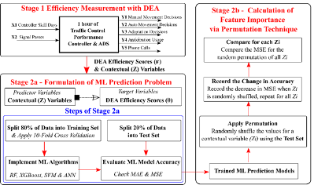

# A Paradigm Ensemble Approach Integrating DEA
and Machine Learning for Efficiency Prediction and
Contextual Factor Consideration

This is the code source for the paper (Topcu, Liu & Triantis, 2020). 

This repository presents a novel three-stage paradigm ensemble that integrates Data Envelopment Analysis (DEA) with Machine Learning (ML) to evaluate the influence of contextual factors on efficiency performance in heterogeneous environments.

While traditional DEA methods assume relatively homogeneous operating conditions, modern socio-technical systems increasingly function under nonlinear and complex dynamics. To address this gap, our framework reveals how contextual variables shape DEA efficiency scores, offering deeper insight for decision-makers and operational stakeholders.

Figure 1.
